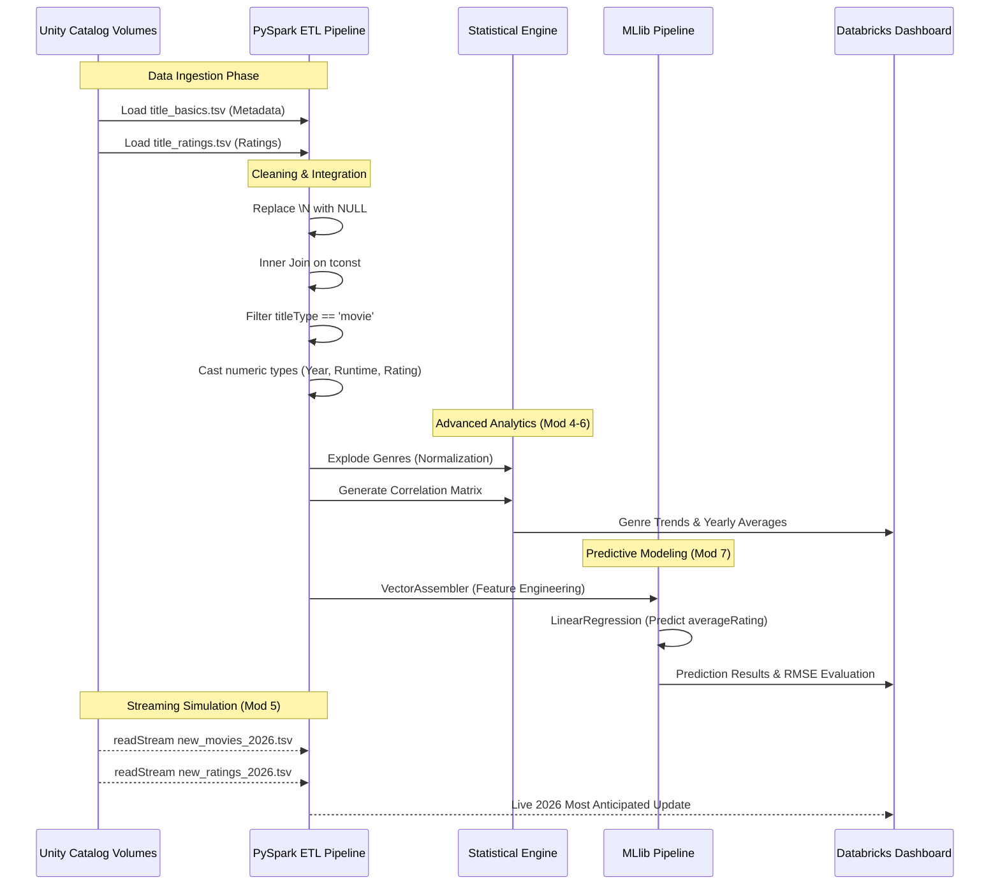

# IMDb Project Pipeline Architecture

This diagram illustrates the end-to-end data flow of the IMDb Big Data Analysis project, from raw fragmented ingestion to final predictive analytics.

## Stage Descriptions

1.  **Data Ingestion**: Multi-source ingestion from Databricks Unity Catalog Volumes.
2.  **Cleaning & Integration**: Standards-compliant handling of IMDb NULL strings (`\N`) and relational joining.
3.  **Genre Explosion**: Advanced transformation to handle multi-genre strings for granular category analysis.
4.  **Statistical Correlation**: Mathematical validation of relationships between movie runtime, popularity, and ratings.
5.  **Machine Learning**: A supervised learning pipeline using Spark MLlib to predict movie ratings based on historical metadata.
6.  **Simulated Streaming**: Real-time ingestion simulation for "2026 Updates" using structured streaming logic.
