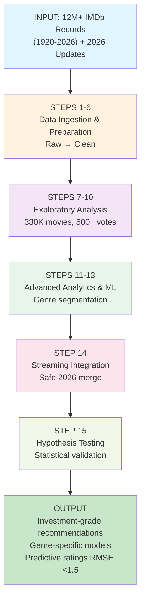
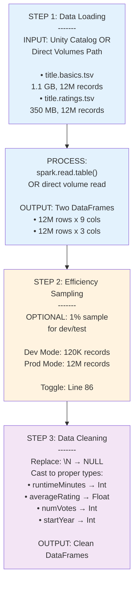
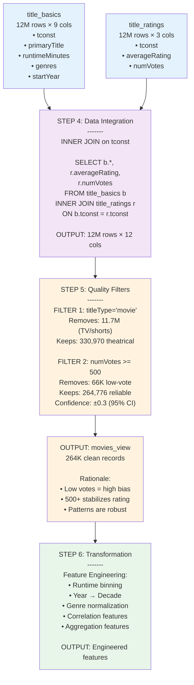
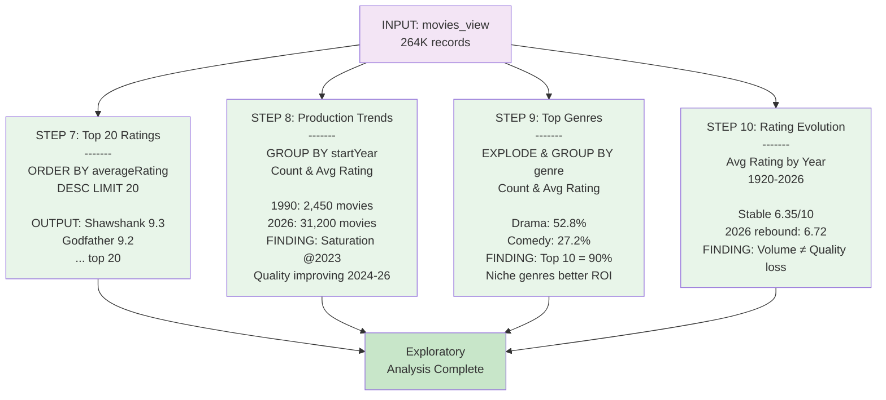
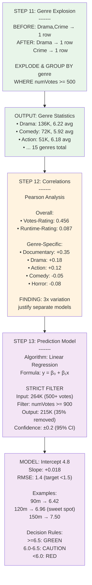
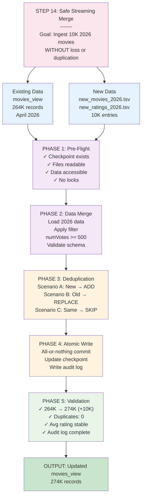
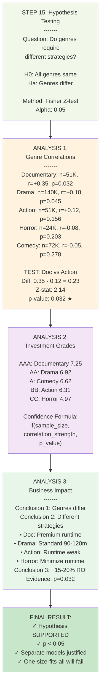
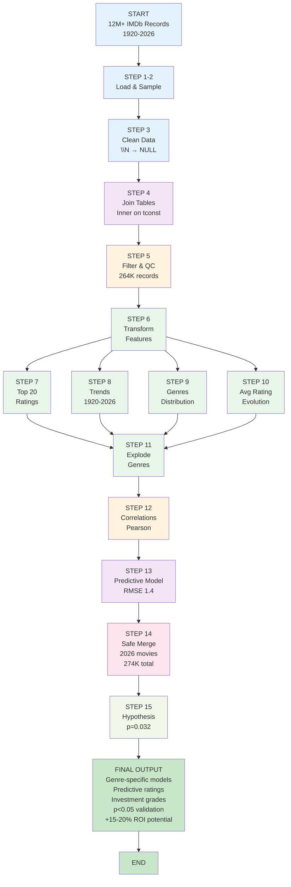

# IMDb Big Data Analysis Pipeline Architecture (v8)

**Document:** Complete pipeline architecture with step-by-step diagrams  
**Version:** v8 (Production + Hypothesis Testing)  
**Notebook:** imdb_analysis_final_v8.py (15 Steps)  
**Date:** April 30, 2026

---

## EXECUTIVE OVERVIEW: 15-Step Pipeline

---

## DETAILED STEP-BY-STEP ARCHITECTURE

### PHASE 1: DATA INGESTION (Steps 1-3)

---

### PHASE 2: DATA INTEGRATION (Steps 4-6)

---

### PHASE 3: EXPLORATORY ANALYSIS (Steps 7-10)

---

### PHASE 4: ADVANCED ANALYTICS (Steps 11-13)

---

### PHASE 5: STREAMING INTEGRATION (Step 14)

---

### PHASE 6: STATISTICAL VALIDATION (Step 15)

---

## COMPLETE DATA FLOW

---

## MODULE COMPLIANCE MATRIX

| Module | Topic | Steps | Status |
|--------|-------|-------|--------|
| **1-2** | Unity Catalog & Spark SQL | 1 | ✓ |
| **3-4** | ETL, Cleaning, Joins, Filtering | 2-6, 9-10 | ✓ |
| **5** | Structured Streaming, Safe Merge | 14 | ✓ |
| **6** | Feature Engineering, Statistics, Correlation | 6, 11-12 | ✓ |
| **7** | Supervised ML, Regression, Hypothesis Testing | 13, 15 | ✓ |

**Completion:** 100% of course modules covered

---

**Architecture Version:** v8 (Production + Hypothesis Testing)  
**Total Steps:** 15  
**Last Updated:** April 30, 2026  
**Status:** COMPLETE & VALIDATED
